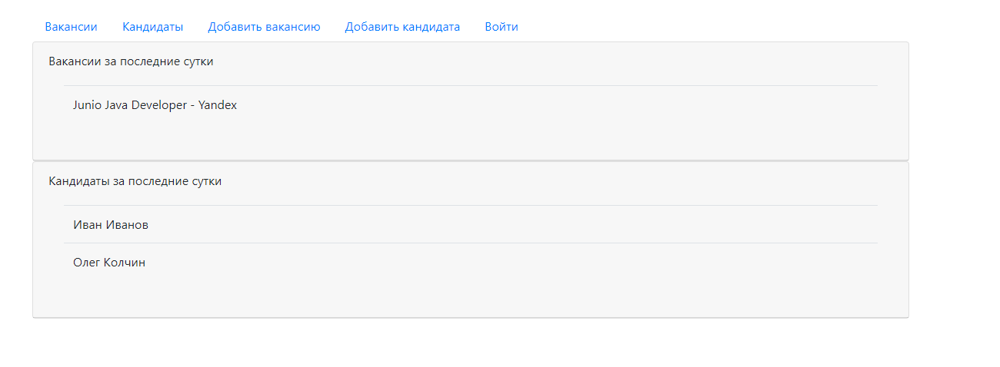
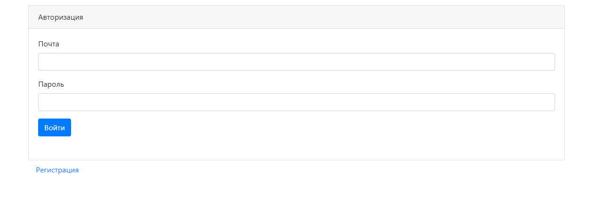
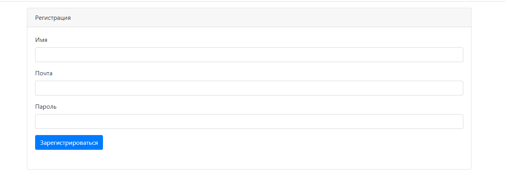
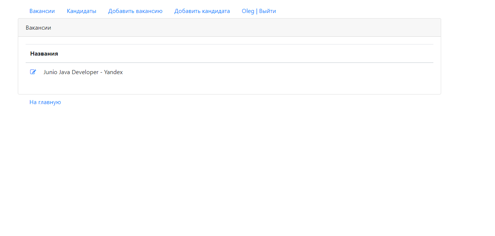
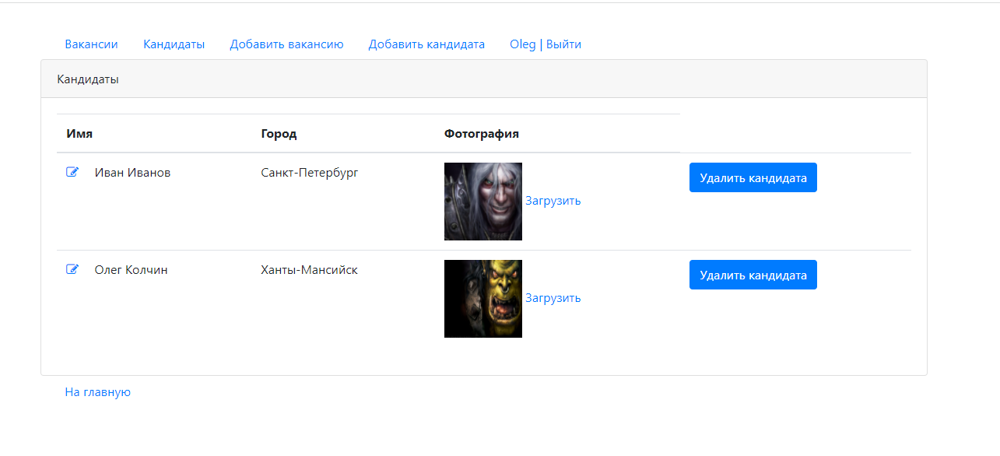
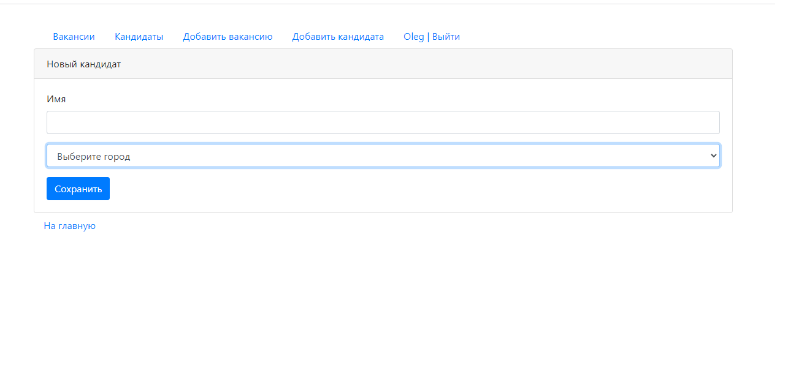
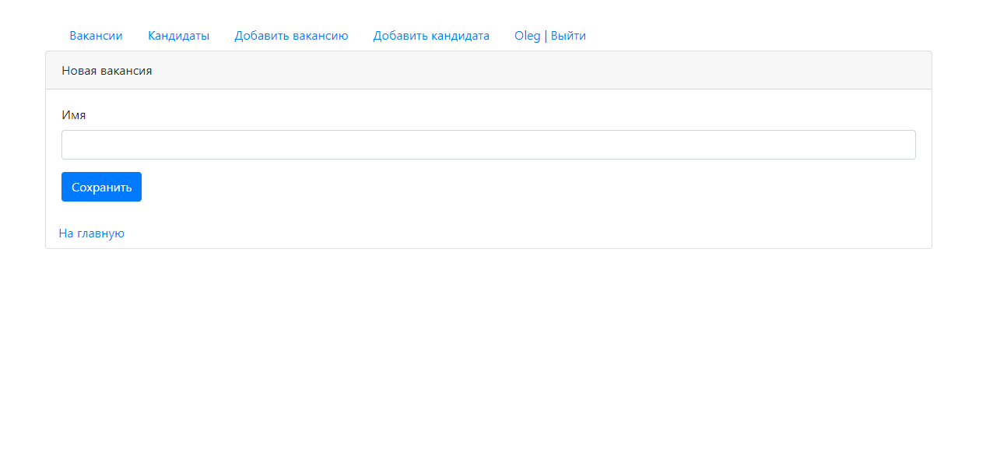

DreamJob
=============

This project is employment agency web-service. It uses jsp and servlets for user interface and JDBC to store and manage data.

Main page. It shows vacancies added in the last 24 hours

Authorization page. It also contains link to registration page.

Registration page

Vacancies page. You also can edit data.

Job-seeker page. You can edit all data, including photo.

Adding new job-seeker

Adding new vacancy

Upload interface for job-seeker's photo
